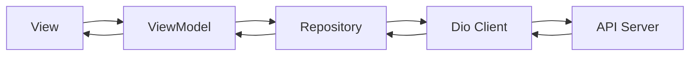

# 🚀 MVVM-GetX

<div align="center">


### 📱 Production Ready Flutter MVVM Architecture using GetX

A scalable, maintainable, and developer-friendly Flutter project structure built with **MVVM Architecture**, **GetX**, **Dio**, **Repository Pattern**, **Dependency Injection**, and **Centralized Exception Handling**.

</div>

---

# ✨ Features

✅ MVVM Architecture

✅ GetX State Management

✅ GetX Dependency Injection

✅ GetX Route Management

✅ Dio API Client

✅ Repository Pattern

✅ Centralized API Handling

✅ Network Exception Handling

✅ Loading & Error States

✅ Reusable Widgets

✅ Scalable Folder Structure

✅ Clean Separation of Concerns

✅ Easy Testing & Maintenance

---

# 🏗️ Architecture Overview

This project follows the **MVVM (Model-View-ViewModel)** architectural pattern.

```text
┌─────────────┐
│    View     │
│   Screen    │
└──────┬──────┘
       │
       ▼
┌─────────────┐
│ ViewModel   │
│ GetX Logic  │
└──────┬──────┘
       │
       ▼
┌─────────────┐
│ Repository  │
│ Data Layer  │
└──────┬──────┘
       │
       ▼
┌─────────────┐
│ Dio Client  │
│ API Layer   │
└──────┬──────┘
       │
       ▼
┌─────────────┐
│ REST API    │
└─────────────┘
```

---

# 🔄 Data Flow



---

# 📂 Project Structure

```text
lib/
│
├── bindings/
│   └── initial_binding.dart
│
├── core/
│   ├── constants/
│   ├── network/
│   ├── exceptions/
│   ├── services/
│   └── utils/
│
├── data/
│   ├── models/
│   ├── providers/
│   └── repositories/
│
├── routes/
│
├── view_models/
│
├── views/
│   ├── screens/
│   └── widgets/
│
└── main.dart
```

---

# 📖 Folder Explanation

## 📦 bindings

Contains all GetX bindings.

Responsible for:

* Dependency Injection
* Controller Registration
* Service Registration
* Lazy Loading

Example:

```dart
class InitialBinding extends Bindings {
  @override
  void dependencies() {
    Get.lazyPut<AuthViewModel>(() => AuthViewModel());
  }
}
```

---

## 🌐 core/network

Contains:

* Dio Client
* API Configuration
* Interceptors
* Request Handlers
* Response Handlers

Responsibilities:

* Send API requests
* Handle headers
* Manage authentication tokens
* Log requests & responses

---

## ⚠️ core/exceptions

Contains custom exception classes.

Examples:

```dart
BadRequestException
UnauthorizedException
NotFoundException
ServerException
NoInternetException
TimeoutException
UnknownException
```

Benefits:

* Centralized error handling
* Cleaner ViewModels
* Consistent API responses

---

## 📦 data/models

Contains API response models.

Example:

```dart
class UserModel {
  final int id;
  final String name;

  UserModel({
    required this.id,
    required this.name,
  });
}
```

Responsibilities:

* JSON Serialization
* API Data Mapping
* Entity Representation

---

## 🗂️ data/repositories

Acts as a bridge between ViewModel and API Layer.

Example:

```dart
class UserRepository {
  final DioClient dioClient;

  UserRepository(this.dioClient);

  Future<List<User>> getUsers() async {
    return await dioClient.getUsers();
  }
}
```

Benefits:

* Decouples API layer
* Improves testability
* Easy data source replacement

---

## 🧠 view_models

Business logic layer.

Responsibilities:

* Manage State
* Handle User Actions
* Call Repositories
* Update UI

Example:

```dart
class UserViewModel extends GetxController {

  final UserRepository repository;

  UserViewModel(this.repository);

  RxBool isLoading = false.obs;
  RxList<User> users = <User>[].obs;

  Future<void> fetchUsers() async {
    isLoading.value = true;

    users.value = await repository.getUsers();

    isLoading.value = false;
  }
}
```

---

## 🎨 views

Contains UI only.

Responsibilities:

* Display Data
* User Interaction
* Navigation

Avoid:

❌ API Calls

❌ Business Logic

❌ Database Operations

---

# 💉 Dependency Injection

The project uses GetX Dependency Injection.

Example:

```dart
Get.put(ApiService());

Get.lazyPut<UserRepository>(
  () => UserRepository(Get.find()),
);

Get.lazyPut<UserViewModel>(
  () => UserViewModel(Get.find()),
);
```

Benefits:

* Loose Coupling
* Better Testability
* Memory Efficient

---

# 🚦 Route Management

Navigation is managed using GetX Routes.

Example:

```dart
GetPage(
  name: Routes.home,
  page: () => HomeView(),
  binding: HomeBinding(),
)
```

Navigate:

```dart
Get.toNamed(Routes.home);
```

---

# 🌍 API Handling Flow

```text
View
 ↓
ViewModel
 ↓
Repository
 ↓
Dio Client
 ↓
REST API
 ↓
Response
 ↓
Repository
 ↓
ViewModel
 ↓
UI Update
```

---

# ⚡ State Management

This project leverages GetX reactive state management.

Reactive Variables:

```dart
var count = 0.obs;
```

UI Updates:

```dart
Obx(
  () => Text(
    count.value.toString(),
  ),
);
```

Benefits:

* Minimal Boilerplate
* High Performance
* Reactive UI Updates

---

# 🚀 Getting Started

## Clone Repository

```bash
git clone https://github.com/Gaurav0307/MVVM-GetX.git
```

## Install Packages

```bash
flutter pub get
```

## Run Project

```bash
flutter run
```

---

# 🛠 Recommended Packages

```yaml
get:
dio:
pretty_dio_logger:
connectivity_plus:
shared_preferences:
```

---

# 🎯 Why This Architecture?

This structure helps developers:

* Build scalable applications
* Maintain clean code
* Separate concerns effectively
* Reduce code duplication
* Improve testability
* Manage state efficiently
* Handle APIs consistently

---

# 📈 Scalability

Suitable for:

✅ Small Apps

✅ Medium Apps

✅ Enterprise Applications

✅ E-Commerce Apps

✅ Booking Apps

✅ Chat Applications

✅ Service Marketplace Apps

✅ Fintech Applications

---

# 🤝 Contributing

Contributions are always welcome.

1. Fork the repository
2. Create a feature branch
3. Commit changes
4. Push changes
5. Create a Pull Request

---

# ⭐ Support

If you find this repository useful, don't forget to:

⭐ Star the repository

🍴 Fork the repository

📢 Share with the Flutter community

---

# 👨‍💻 Author

**Gaurav Prasad**

Flutter Developer • Node.js Backend Developer

GitHub:
https://github.com/Gaurav0307

---

# 📄 License

This project is licensed under the MIT License.

---

<div align="center">

### Built with ❤️ using Flutter + GetX + MVVM

⭐ Star the repository if it helped you!

</div>
